### users
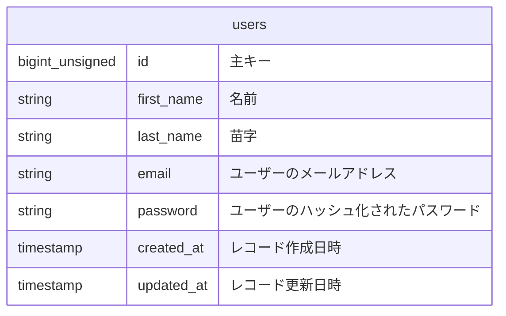
```mermaid
erDiagram
    users {
        bigint_unsigned id "主キー"
        string first_name "名前"
        string last_name "苗字"
        string email "ユーザーのメールアドレス"
        string password "ユーザーのハッシュ化されたパスワード"
        timestamp created_at "レコード作成日時"
        timestamp updated_at "レコード更新日時"
    }
```

### orders
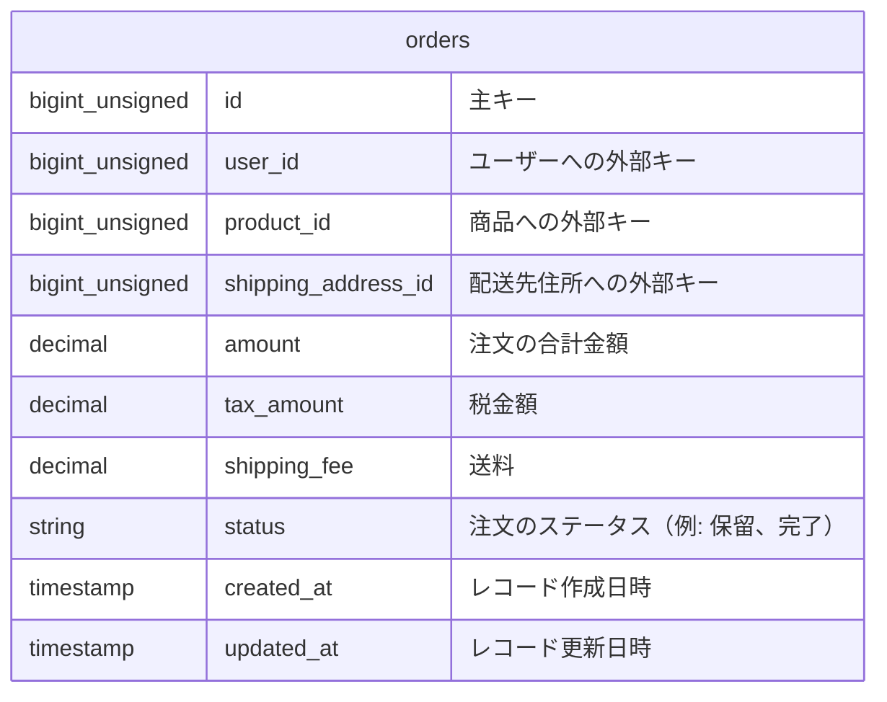
```mermaid
erDiagram
    orders {
        bigint_unsigned id "主キー"
        bigint_unsigned user_id "ユーザーへの外部キー"
        bigint_unsigned product_id "商品への外部キー"
        bigint_unsigned shipping_address_id "配送先住所への外部キー"
        decimal amount "注文の合計金額"
        decimal tax_amount "税金額"
        decimal shipping_fee "送料"
        string status "注文のステータス（例: 保留、完了）"
        timestamp created_at "レコード作成日時"
        timestamp updated_at "レコード更新日時"    
    }
```

### payment_failures
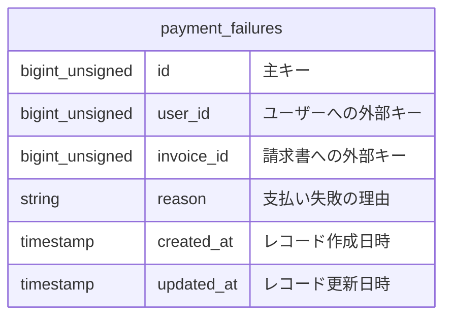
```mermaid
erDiagram
    payment_failures {
        bigint_unsigned id "主キー"
        bigint_unsigned user_id "ユーザーへの外部キー"
        bigint_unsigned invoice_id "請求書への外部キー"
        string reason "支払い失敗の理由"
        timestamp created_at "レコード作成日時"
        timestamp updated_at "レコード更新日時"
    }
```

### subscriptions
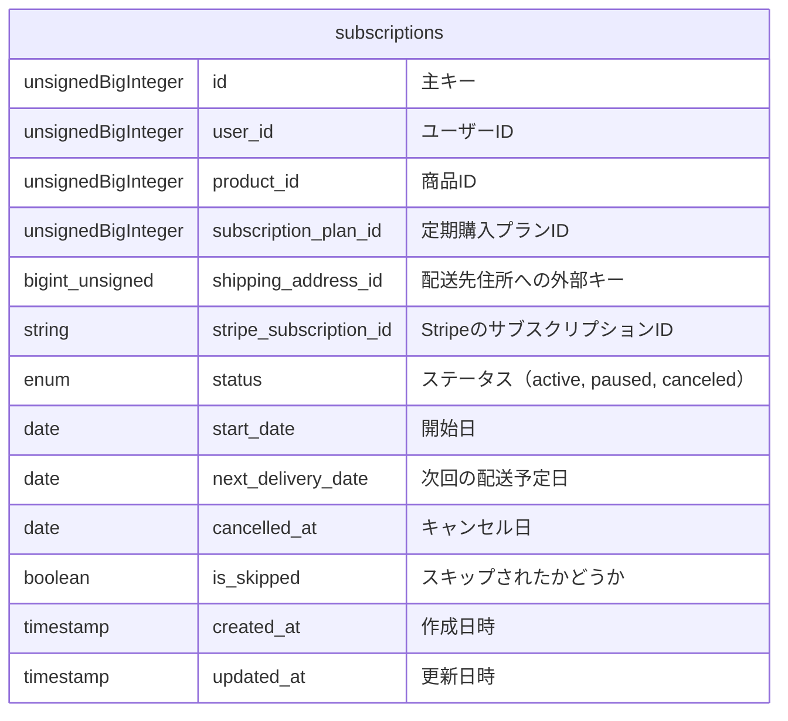
```mermaid
erDiagram
    subscriptions {
        unsignedBigInteger id "主キー"
        unsignedBigInteger user_id "ユーザーID"
        unsignedBigInteger product_id "商品ID"
        unsignedBigInteger subscription_plan_id "定期購入プランID"
        bigint_unsigned shipping_address_id "配送先住所への外部キー"
        string stripe_subscription_id "StripeのサブスクリプションID"
        enum status "ステータス（active, paused, canceled）"
        date start_date "開始日"
        date next_delivery_date "次回の配送予定日"
        date cancelled_at "キャンセル日"
        boolean is_skipped "スキップされたかどうか"
        timestamp created_at "作成日時"
        timestamp updated_at "更新日時"
    }
```

### subscription_plans
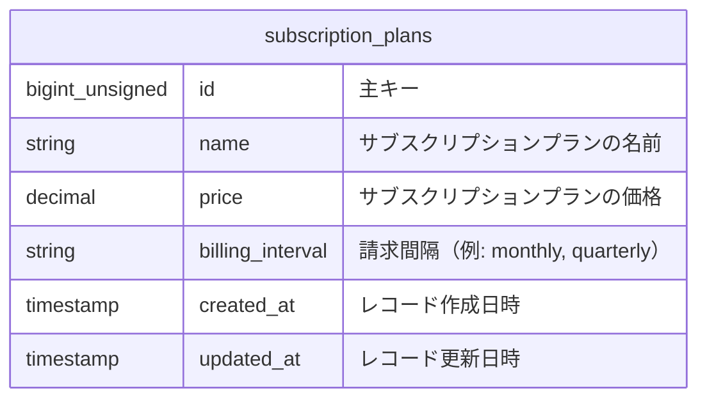
```mermaid
erDiagram
    subscription_plans {
        bigint_unsigned id "主キー"
        string name "サブスクリプションプランの名前"
        decimal price "サブスクリプションプランの価格"
        string billing_interval "請求間隔（例: monthly, quarterly）"
        timestamp created_at "レコード作成日時"
        timestamp updated_at "レコード更新日時"
    }
```

### products
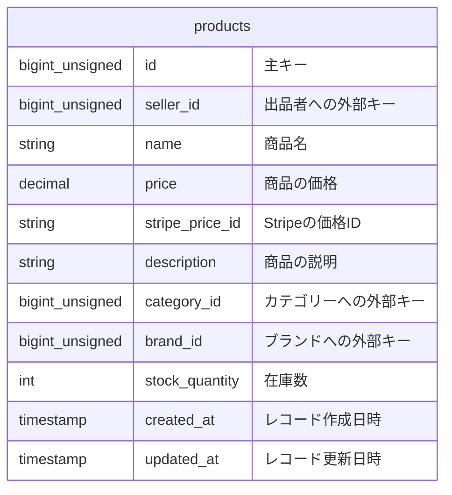
```mermaid
erDiagram
    products {
        bigint_unsigned id "主キー"
        bigint_unsigned seller_id "出品者への外部キー"
        string name "商品名"
        decimal price "商品の価格"
        string stripe_price_id "Stripeの価格ID"
        string description "商品の説明"
        bigint_unsigned category_id "カテゴリーへの外部キー"
        bigint_unsigned brand_id "ブランドへの外部キー"
        int stock_quantity "在庫数"
        timestamp created_at "レコード作成日時"
        timestamp updated_at "レコード更新日時"
    }
```

### product_images
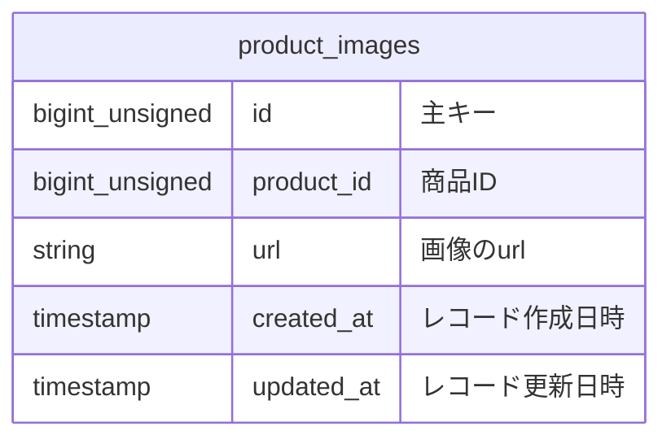
```mermaid
erDiagram
  product_images {
      bigint_unsigned id "主キー"
      bigint_unsigned product_id "商品ID"
      string url "画像のurl"
      timestamp created_at "レコード作成日時"
      timestamp updated_at "レコード更新日時"
  }
```

### reviews
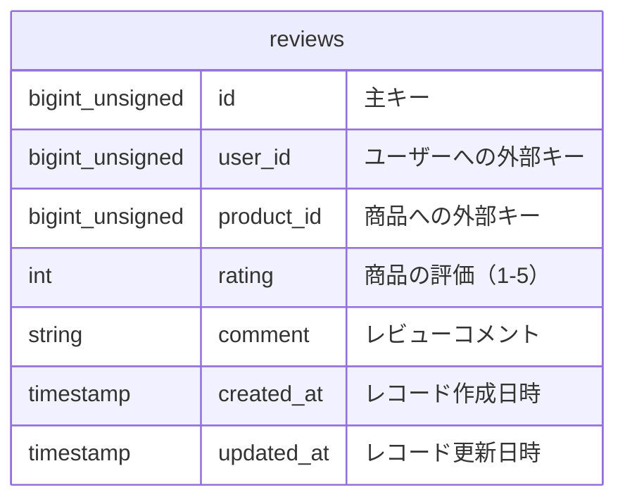
```mermaid
erDiagram
    reviews {
        bigint_unsigned id "主キー"
        bigint_unsigned user_id "ユーザーへの外部キー"
        bigint_unsigned product_id "商品への外部キー"
        int rating "商品の評価（1-5）"
        string comment "レビューコメント"
        timestamp created_at "レコード作成日時"
        timestamp updated_at "レコード更新日時"
    }
```

### review_images
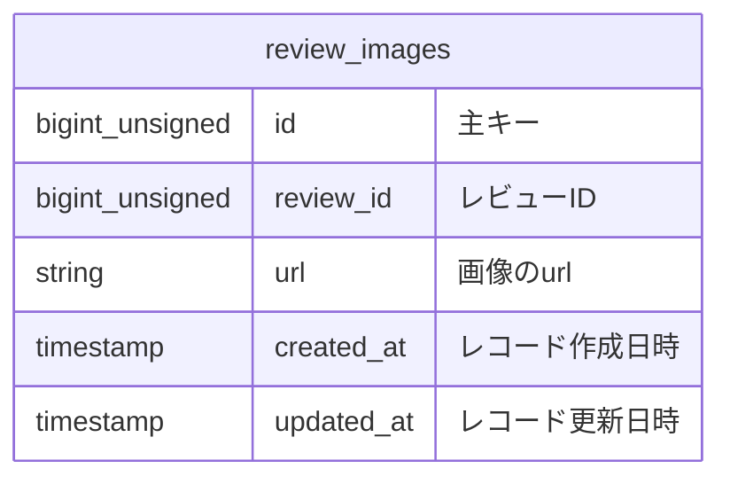
```mermaid
erDiagram
  review_images {
      bigint_unsigned id "主キー"
      bigint_unsigned review_id "レビューID"
      string url "画像のurl"
      timestamp created_at "レコード作成日時"
      timestamp updated_at "レコード更新日時"
  }
```

### invoices
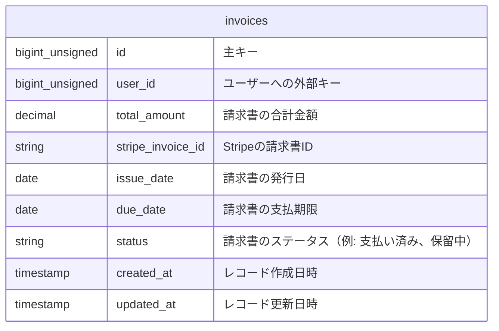
```mermaid
erDiagram
    invoices {
        bigint_unsigned id "主キー"
        bigint_unsigned user_id "ユーザーへの外部キー"
        decimal total_amount "請求書の合計金額"
        string stripe_invoice_id "Stripeの請求書ID"
        date issue_date "請求書の発行日"
        date due_date "請求書の支払期限"
        string status "請求書のステータス（例: 支払い済み、保留中）"
        timestamp created_at "レコード作成日時"
        timestamp updated_at "レコード更新日時"
    }
```

### categories
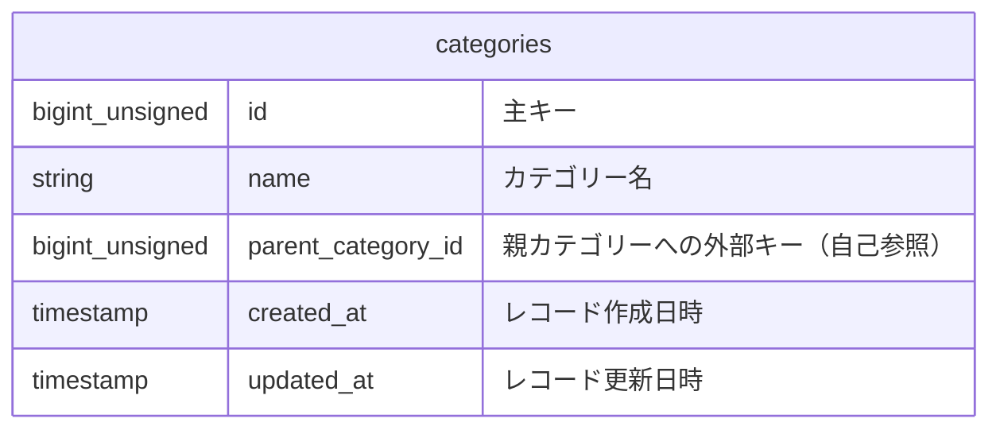
```mermaid
erDiagram
    categories {
        bigint_unsigned id "主キー"
        string name "カテゴリー名"
        bigint_unsigned parent_category_id "親カテゴリーへの外部キー（自己参照）"
        timestamp created_at "レコード作成日時"
        timestamp updated_at "レコード更新日時"
    }
```

### brands
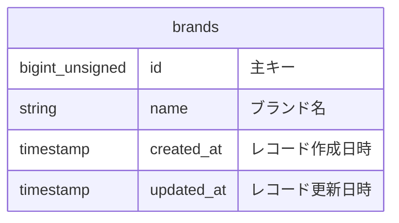
```mermaid
erDiagram
    brands {
        bigint_unsigned id "主キー"
        string name "ブランド名"
        timestamp created_at "レコード作成日時"
        timestamp updated_at "レコード更新日時"
    }
```

### cart_items
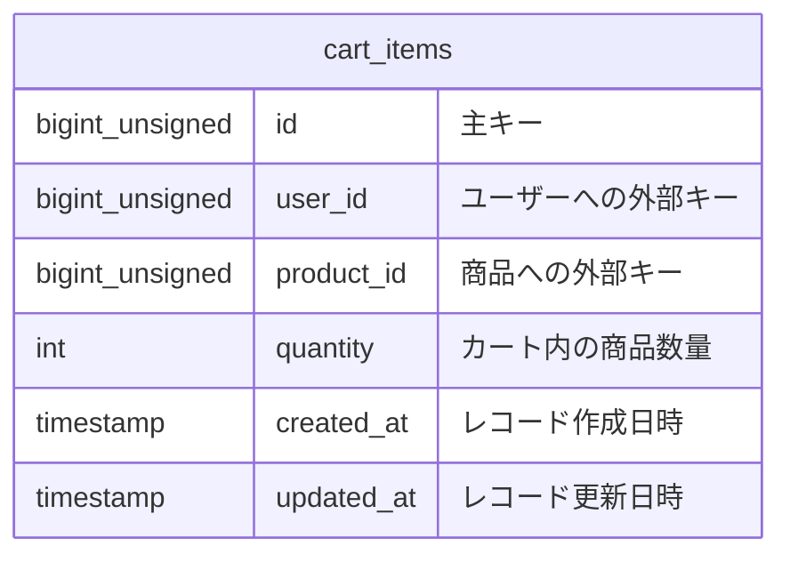
```mermaid
erDiagram
    cart_items {
        bigint_unsigned id "主キー"
        bigint_unsigned user_id "ユーザーへの外部キー"
        bigint_unsigned product_id "商品への外部キー"
        int quantity "カート内の商品数量"
        timestamp created_at "レコード作成日時"
        timestamp updated_at "レコード更新日時"
    }
```

### order_items
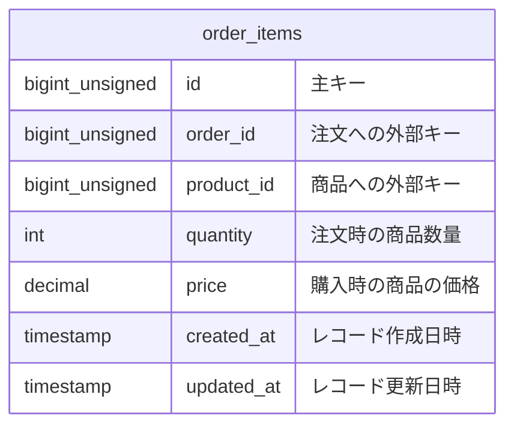
```mermaid
erDiagram
    order_items {
        bigint_unsigned id "主キー"
        bigint_unsigned order_id "注文への外部キー"
        bigint_unsigned product_id "商品への外部キー"
        int quantity "注文時の商品数量"
        decimal price "購入時の商品の価格"
        timestamp created_at "レコード作成日時"
        timestamp updated_at "レコード更新日時"
    }
```

### sellers
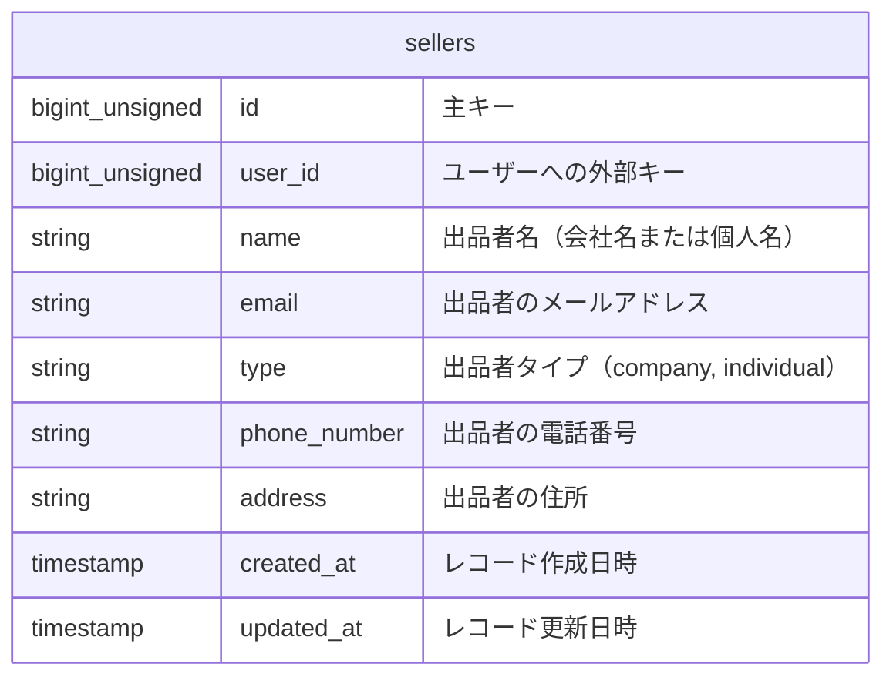
```mermaid
erDiagram
    sellers {
        bigint_unsigned id "主キー"
        bigint_unsigned user_id "ユーザーへの外部キー"
        string name "出品者名（会社名または個人名）"
        string email "出品者のメールアドレス"
        string type "出品者タイプ（company, individual）"
        string phone_number "出品者の電話番号"
        string address "出品者の住所"
        timestamp created_at "レコード作成日時"
        timestamp updated_at "レコード更新日時"
    }
```

### payment_methods
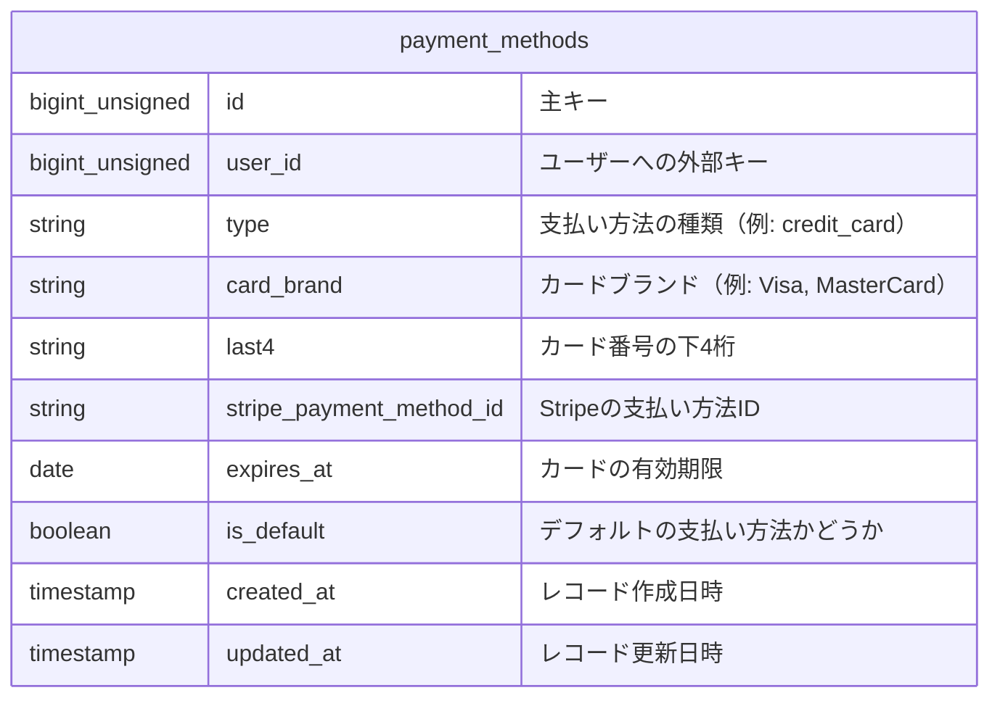
```mermaid
erDiagram
    payment_methods {
        bigint_unsigned id "主キー"
        bigint_unsigned user_id "ユーザーへの外部キー"
        string type "支払い方法の種類（例: credit_card）"
        string card_brand "カードブランド（例: Visa, MasterCard）"
        string last4 "カード番号の下4桁"
        string stripe_payment_method_id "Stripeの支払い方法ID"
        date expires_at "カードの有効期限"
        boolean is_default "デフォルトの支払い方法かどうか"
        timestamp created_at "レコード作成日時"
        timestamp updated_at "レコード更新日時"
    }
```

### shipping_addresses
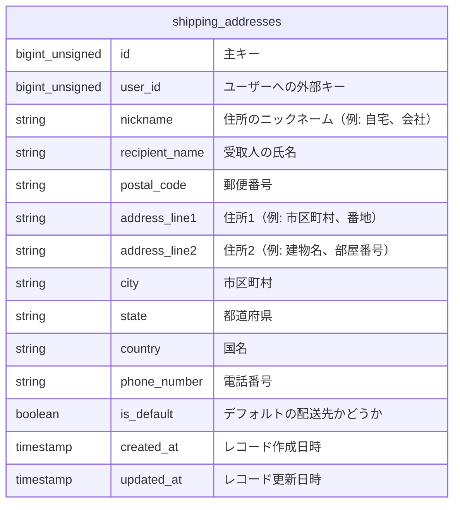
```mermaid
erDiagram
    shipping_addresses {
        bigint_unsigned id "主キー"
        bigint_unsigned user_id "ユーザーへの外部キー"
        string nickname "住所のニックネーム（例: 自宅、会社）"
        string recipient_name "受取人の氏名"
        string postal_code "郵便番号"
        string address_line1 "住所1（例: 市区町村、番地）"
        string address_line2 "住所2（例: 建物名、部屋番号）"
        string city "市区町村"
        string state "都道府県"
        string country "国名"
        string phone_number "電話番号"
        boolean is_default "デフォルトの配送先かどうか"
        timestamp created_at "レコード作成日時"
        timestamp updated_at "レコード更新日時"
    }
```